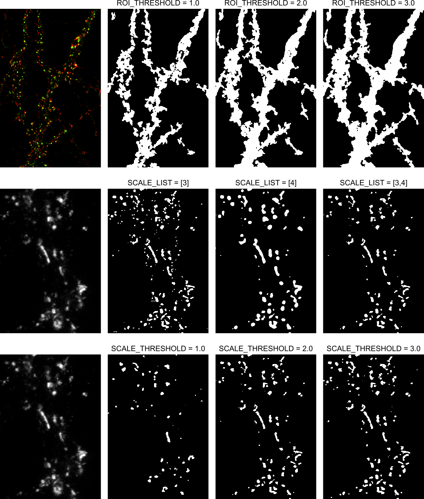

# pySODA

Adapts the SODA colocalisation method from https://www.nature.com/articles/s41467-018-03053-x#Sec26 from Icy (Java) to Python.

The SODA algorithm calculates the probability that particles in super-resolution images are coupled for discrete 
intervals of distances separating them. 

**Related paper**: *Activity-dependent changes of synaptic protein clusters revealed by multidimensional analysis with multicolor STED nanoscopy*

## Requirements:
  - Python 3.X with the following libraries installed:
    - numpy
    - scikit-image
    - matplotlib
    - scipy
    - xlsxwriter

The Anaconda distribution of Python covers all of these.
  - Two- or three-channel super-resolution microscopy images. The analysis will run on all combinations of two channels.

## Contents:
  - `run_SODA.py`: This is the script to execute in order to run the SODA analysis. Parameters are also set within this file.
  - `steps_SODA.py`: This file contains the SODA analysis pipeline.
  - `wavelet_SODA.py`: This file implements the base functions for the segmentation and the SODA statistical analysis.
  - `example_image`: An example two-color STED image is provided to test the algorithm.
  - `example_output`: The pySODA output of the example image. Parameters are specified in the `output_info` text file.

## How to use pySODA:

The `run_soda.py` allows the user to run the SODA analysis on all images within a chosen folder using
chosen parameters.

**1 -** Edit the parameters in the `run_soda.py` file:
  
  - Directory parameters:
  
        DIRECTORY : Path containing TIF files.
        OUTPUT_DIRECTORY : Path in which to save output excel files and images. Will be created if it doesn't exist.

  - Segmentation parameters:
  
        ROI_THRESHOLD : Multiplier of ROI threshold. Higher value means more pixels considered. (float)
        
        SCALE_LIST : List of scales to be used for the multiscale product segmentation of spots.
                     Takes the form of a list containing a list of integers for each channel.
                     ex: [[1,2],   Scales for channel 0
                          [2,3]]   Scales for channel 1
                          
        SCALE_THRESHOLD : Multiplier of the wavelet transform segmentation threshold.
                          Higher value means more pixels considered. List of one value per channel.
                          ex: [1.0,   Channel 0
                               2.0]   Channel 1
  
  - SODA parameters:
                      
        MIN_SIZE : Minimum area (in pixels) of spots to be considered in the analysis. List of one value per channel.
        MIN_AXIS_LENGTH : Minimum length (in pixels) of both ellipse axes of spots to analyse. List of one value per channel.
    
        N_RINGS : Number of rings around spots (int)
        RING_WIDTH : Width of rings in pixels (int)
        SELF_SODA : Whether to compute SODA for couples of spots in the same channel as well (bool)
  
  - Output parameters:
  
        SAVE_ROI : Whether to save TIF images of spots detection and masks in OUTPUT_DIRECTORY (bool)
        WRITE_HIST : Whether to create a .pdf of the coupling probabilities by distance histogram (bool)

**2 -** Execute run_soda.py. This will run the SODA analysis on every .tif image in the chosen `DIRECTORY` using the specified
parameters.

### Examples of segmentation parameters

## Output:

**For each TIF file**: An excel file `pySODA_[image name]_chXY.xlsx` containing information on each individual spot 
and each couple from channels X and Y.

**For the entire dataset**: An excel file `pySODA_results_[directory name].xlsx` containing global information about the analysis: coupling indices for each image, mean coupling distances, etc.

**If `SAVE_ROI` is True**: For each image, four .tif files are created.
 - *_all_spots.tif: The wavelet transform multiscale product segmentation of the original image.
 - *_filtered_spots.tif: Spots segmentation image with spots that don't correspond to the `MIN_SIZE` and `MIN_AXIS_LENGTH`
 parameters filtered out.
 - *_spots_in_mask.tif: The filtered spots image with only the spots within the dendritic mask.
 - *_mask.tif: Image of the dendritic mask.
 
**If `WRITE_HIST` is True**: A histogram of the coupling probability by the distance is saved as well.
 
 All of these outputs ares saved in the specified `OUTPUT_DIRECTORY`.